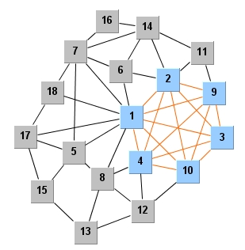

<h1>Genetic Algorithm for the Maximum Clique Problem</h1>

<i><h3>Shalin Shah</h3></i>

Implementation of a genetic algorithm for the maximum clique problem in C++. A clique of a graph is a set of vertices in which each pair in the set have an edge between them i.e. it is a complete subgraph. A clique of maximum size is called the maximum clique. The algorithm uses new types of crossovers to achieve good results on several public graph datasets.

<pre>The code needs a data.CLQ file in the current directory. One is included. 
Compile the code using g++ and then just run it. 
You can change the file name in the processData() function.</pre>

<i>(If you are looking for a simpler algorithm in Java, please see <a href="https://github.com/shah314/clique2">clique2</a>)</i>

<i>(The intersection crossover was borrowed from a similar idea in <a href="http://www.dharwadker.org/clique/">this algorithm</a>)</i>

 Results on 
some <A href="http://dimacs.rutgers.edu/Challenges/">DIMACS</A> instances are 
show in the following table. The algorithm is allowed to run for a maximum duration of 30 seconds.&nbsp;

<ul>
  <li> The best performance is on the <b>hamming</b>, <b>p_hat</b> and <b>c-fat </b>instances.</li>
  <li>The worst performance is on the <b>san1000</b> and <b>brock </b>instances.</li>
  <li>Please remove all comments and other extraneous text from the graph text instance file.</li>
</ul>

<TABLE>
  <TR>
    <TD   >Instance</B></TD>
    <TD   >Vertices</B></TD>
    <TD   >Edges</B></TD>
    <TD   >Best Known</B></TD>
    <TD   >Found</B></TD>
    <TD   
  >Duration (seconds)&nbsp;</B></TD></TR>
  <TR>
    <TD  >brock200_1</TD>
    <TD  >200</TD>
    <TD  >14834</TD>
    <TD  >21</TD>
    <TD  >21</TD>
    <TD  >9</TD></TR>
  <TR>
    <TD  >brock200_2</TD>
    <TD  >200</TD>
    <TD  >9876</TD>
    <TD  >12</TD>
    <TD  >12</TD>
    <TD  >30</TD></TR>
  <TR>
    <TD  >brock200_3</TD>
    <TD  >200</TD>
    <TD  >12048</TD>
    <TD  >15</TD>
    <TD  >15</TD>
    <TD  >10</TD></TR>
  <TR>
    <TD  >brock200_4</TD>
    <TD  >200</TD>
    <TD  >13089</TD>
    <TD  >17</TD>
    <TD  >16</TD>
    <TD  >2</TD></TR>
  <TR>
    <TD  >brock400_1</TD>
    <TD  >400</TD>
    <TD  >59723</TD>
    <TD  >27</TD>
    <TD  >25</TD>
    <TD  >5</TD></TR>
  <TR>
    <TD  >brock400_2</TD>
    <TD  >400</TD>
    <TD  >59786</TD>
    <TD  >29</TD>
    <TD  >25</TD>
    <TD  >14</TD></TR>
  <TR>
    <TD  >brock400_3</TD>
    <TD  >400</TD>
    <TD  >59681</TD>
    <TD  >31</TD>
    <TD  >25</TD>
    <TD  >10</TD></TR>
  <TR>
    <TD  >brock800_1</TD>
    <TD  >800</TD>
    <TD  >207505</TD>
    <TD  >23</TD>
    <TD  >20</TD>
    <TD  >2</TD></TR>
  <TR>
    <TD  >C125.9</TD>
    <TD  >125</TD>
    <TD  >6963</TD>
    <TD  >34</TD>
    <TD  >34</TD>
    <TD  >0</TD></TR>
  <TR>
    <TD  >C250.9</TD>
    <TD  >250</TD>
    <TD  >27984</TD>
    <TD  >44</TD>
    <TD  >43</TD>
    <TD  >30</TD></TR>
  <TR>
    <TD  >C500.9</TD>
    <TD  >500</TD>
    <TD  >112332</TD>
    <TD  >57</TD>
    <TD  >55</TD>
    <TD  >5</TD></TR>
  <TR>
    <TD  >C1000.9</TD>
    <TD  >1000</TD>
    <TD  >450079</TD>
    <TD  >67</TD>
    <TD  >65</TD>
    <TD  >3</TD></TR>
  <TR>
    <TD  >C2000.5</TD>
    <TD  >2000</TD>
    <TD  >999836</TD>
    <TD  >16</TD>
    <TD  >15</TD>
    <TD  >5</TD></TR>
  <TR>
    <TD  >C2000.9</TD>
    <TD  >2000</TD>
    <TD  >1799532</TD>
    <TD  >75</TD>
    <TD  >73</TD>
    <TD  >9</TD></TR>
  <TR>
    <TD  >C4000.5</TD>
    <TD  >4000</TD>
    <TD  >4000268</TD>
    <TD  >18</TD>
    <TD  >16</TD>
    <TD  >28</TD></TR>
  <TR>
    <TD  >c-fat200-1</TD>
    <TD  >200</TD>
    <TD  >1534</TD>
    <TD  >12</TD>
    <TD  >12</TD>
    <TD  >0</TD></TR>
  <TR>
    <TD  >c-fat200-2</TD>
    <TD  >200</TD>
    <TD  >3235</TD>
    <TD  >24</TD>
    <TD  >24</TD>
    <TD  >0</TD></TR>
  <TR>
    <TD  >c-fat200-5</TD>
    <TD  >200</TD>
    <TD  >8473</TD>
    <TD  >58</TD>
    <TD  >58</TD>
    <TD  >0</TD></TR>
  <TR>
    <TD  >c-fat500-1</TD>
    <TD  >500</TD>
    <TD  >4459</TD>
    <TD  >14</TD>
    <TD  >14</TD>
    <TD  >0</TD></TR>
  <TR>
    <TD  >c-fat500-2</TD>
    <TD  >500</TD>
    <TD  >9139</TD>
    <TD  >26</TD>
    <TD  >26</TD>
    <TD  >0</TD></TR>
  <TR>
    <TD  >c-fat500-5</TD>
    <TD  >500</TD>
    <TD  >23191</TD>
    <TD  >64</TD>
    <TD  >64</TD>
    <TD  >0</TD></TR>
  <TR>
    <TD  >c-fat500-10</TD>
    <TD  >500</TD>
    <TD  >46627</TD>
    <TD  >126</TD>
    <TD  >126</TD>
    <TD  >1</TD></TR>
  <TR>
    <TD  >DSJC500.5</TD>
    <TD  >500</TD>
    <TD  >125248</TD>
    <TD  >13</TD>
    <TD  >13</TD>
    <TD  >3</TD></TR>
  <TR>
    <TD  >DSJC1000.5</TD>
    <TD  >1000</TD>
    <TD  >499652</TD>
    <TD  >15</TD>
    <TD  >14</TD>
    <TD  >5</TD></TR>
  <TR>
    <TD  >gen200_p0.9_44</TD>
    <TD  >200</TD>
    <TD  >17910</TD>
    <TD  >44</TD>
    <TD  >40</TD>
    <TD  >5</TD></TR>
  <TR>
    <TD  >gen400_p0.9_55</TD>
    <TD  >400</TD>
    <TD  >71820</TD>
    <TD  >55</TD>
    <TD  >51</TD>
    <TD  >2</TD></TR>
  <TR>
    <TD  >hamming6-2</TD>
    <TD  >64</TD>
    <TD  >1824</TD>
    <TD  >32</TD>
    <TD  >32</TD>
    <TD  >0</TD></TR>
  <TR>
    <TD  >hamming6-4</TD>
    <TD  >64</TD>
    <TD  >704</TD>
    <TD  >4</TD>
    <TD  >4</TD>
    <TD  >0</TD></TR>
  <TR>
    <TD  >hamming8-2</TD>
    <TD  >256</TD>
    <TD  >31616</TD>
    <TD  >128</TD>
    <TD  >128</TD>
    <TD  >1</TD></TR>
  <TR>
    <TD  >hamming8-4</TD>
    <TD  >256</TD>
    <TD  >20864</TD>
    <TD  >16</TD>
    <TD  >16</TD>
    <TD  >0</TD></TR>
  <TR>
    <TD  >hamming10-2</TD>
    <TD  >1024</TD>
    <TD  >518656</TD>
    <TD  >512</TD>
    <TD  >512</TD>
    <TD  >1</TD></TR>
  <TR>
    <TD  >hamming10-4</TD>
    <TD  >1024</TD>
    <TD  >434176</TD>
    <TD  >40</TD>
    <TD  >40</TD>
    <TD  >10</TD></TR>
  <TR>
    <TD  >johnson32-2-4</TD>
    <TD  >496</TD>
    <TD  >107880</TD>
    <TD  >16</TD>
    <TD  >16</TD>
    <TD  >0</TD></TR>
  <TR>
    <TD  >keller4</TD>
    <TD  >171</TD>
    <TD  >9435</TD>
    <TD  >11</TD>
    <TD  >11</TD>
    <TD  >0</TD></TR>
  <TR>
    <TD  >keller5</TD>
    <TD  >776</TD>
    <TD  >225990</TD>
    <TD  >27</TD>
    <TD  >27</TD>
    <TD  >10</TD></TR>
  <TR>
    <TD  >MANN_a27</TD>
    <TD  >378</TD>
    <TD  >70551</TD>
    <TD  >126</TD>
    <TD  >125</TD>
    <TD  >1</TD></TR>
  <TR>
    <TD  >MANN_a45</TD>
    <TD  >1035</TD>
    <TD  >533115</TD>
    <TD  >345</TD>
    <TD  >342</TD>
    <TD  >2</TD></TR>
  <TR>
    <TD  >MANN_a81</TD>
    <TD  >3321</TD>
    <TD  >5506380</TD>
    <TD  >&gt;=1100</TD>
    <TD  >1096</TD>
    <TD  >25</TD></TR>
  <TR>
    <TD  >p_hat300-1</TD>
    <TD  >300</TD>
    <TD  >10933</TD>
    <TD  >8</TD>
    <TD  >8</TD>
    <TD  >0</TD></TR>
  <TR>
    <TD  >p_hat300-2</TD>
    <TD  >300</TD>
    <TD  >21928</TD>
    <TD  >25</TD>
    <TD  >25</TD>
    <TD  >0</TD></TR>
  <TR>
    <TD  >p_hat300-3</TD>
    <TD  >300</TD>
    <TD  >33390</TD>
    <TD  >36</TD>
    <TD  >36</TD>
    <TD  >30</TD></TR>
  <TR>
    <TD  >p_hat500-1</TD>
    <TD  >500</TD>
    <TD  >31569</TD>
    <TD  >9</TD>
    <TD  >9</TD>
    <TD  >0</TD></TR>
  <TR>
    <TD  >p_hat500-2</TD>
    <TD  >500</TD>
    <TD  >62946</TD>
    <TD  >36</TD>
    <TD  >36</TD>
    <TD  >0</TD></TR>
  <TR>
    <TD  >p_hat500-3</TD>
    <TD  >500</TD>
    <TD  >93800</TD>
    <TD  >&gt;=50</TD>
    <TD  >49</TD>
    <TD  >0</TD></TR>
  <TR>
    <TD  >p_hat700-1</TD>
    <TD  >700</TD>
    <TD  >60999</TD>
    <TD  >11</TD>
    <TD  >11</TD>
    <TD  >9</TD></TR>
  <TR>
    <TD  >p_hat700-2</TD>
    <TD  >700</TD>
    <TD  >121728</TD>
    <TD  >&gt;=44</TD>
    <TD  >44</TD>
    <TD  >0</TD></TR>
  <TR>
    <TD  >p_hat700-3</TD>
    <TD  >700</TD>
    <TD  >183010</TD>
    <TD  >&gt;=62</TD>
    <TD  >62</TD>
    <TD  >3</TD></TR>
  <TR>
    <TD  >p_hat1000-1</TD>
    <TD  >1000</TD>
    <TD  >122253</TD>
    <TD  >&gt;=10</TD>
    <TD  >10</TD>
    <TD  >2</TD></TR>
  <TR>
    <TD  >p_hat1000-2</TD>
    <TD  >1000</TD>
    <TD  >244799</TD>
    <TD  >&gt;=46</TD>
    <TD  >46</TD>
    <TD  >5</TD></TR>
  <TR>
    <TD  >p_hat1000-3</TD>
    <TD  >1000</TD>
    <TD  >371746</TD>
    <TD  >&gt;=68</TD>
    <TD  >65</TD>
    <TD  >11</TD></TR>
  <TR>
    <TD  >p_hat1500-1</TD>
    <TD  >1500</TD>
    <TD  >284923</TD>
    <TD  >&gt;=12</TD>
    <TD  >11</TD>
    <TD  >2</TD></TR>
  <TR>
    <TD  >p_hat1500-2</TD>
    <TD  >1500</TD>
    <TD  >568960</TD>
    <TD  >&gt;=65</TD>
    <TD  >65</TD>
    <TD  >2</TD></TR>
  <TR>
    <TD  >p_hat1500-3</TD>
    <TD  >1500</TD>
    <TD  >847244</TD>
    <TD  >&gt;=94</TD>
    <TD  >93</TD>
    <TD  >8</TD></TR>
  <TR>
    <TD  >san200_0.7_1</TD>
    <TD  >200</TD>
    <TD  >13930</TD>
    <TD  >30</TD>
    <TD  >30</TD>
    <TD  >0</TD></TR>
  <TR>
    <TD  >san200_0.7_2</TD>
    <TD  >200</TD>
    <TD  >13930</TD>
    <TD  >18</TD>
    <TD  >18</TD>
    <TD  >2</TD></TR>
  <TR>
    <TD  >san200_0.9_1</TD>
    <TD  >200</TD>
    <TD  >17910</TD>
    <TD  >70</TD>
    <TD  >70</TD>
    <TD  >16</TD></TR>
  <TR>
    <TD  >san200_0.9_2</TD>
    <TD  >200</TD>
    <TD  >17910</TD>
    <TD  >60</TD>
    <TD  >60</TD>
    <TD  >28</TD></TR>
  <TR>
    <TD  >san200_0.9_3</TD>
    <TD  >200</TD>
    <TD  >17910</TD>
    <TD  >44</TD>
    <TD  >37</TD>
    <TD  >5</TD></TR>
  <TR>
    <TD  >san400_0.5_1</TD>
    <TD  >400</TD>
    <TD  >39900</TD>
    <TD  >13</TD>
    <TD  >13</TD>
    <TD  >1</TD></TR>
  <TR>
    <TD  >san400_0.7_1</TD>
    <TD  >400</TD>
    <TD  >55860</TD>
    <TD  >40</TD>
    <TD  >40</TD>
    <TD  >5</TD></TR>
  <TR>
    <TD  >san400_0.7_2</TD>
    <TD  >400</TD>
    <TD  >55860</TD>
    <TD  >30</TD>
    <TD  >30</TD>
    <TD  >2</TD></TR>
  <TR>
    <TD  >san400_0.7_3</TD>
    <TD  >400</TD>
    <TD  >55860</TD>
    <TD  >22</TD>
    <TD  >18</TD>
    <TD  >20</TD></TR>
  <TR>
    <TD  >san400_0.9_1</TD>
    <TD  >400</TD>
    <TD  >71820</TD>
    <TD  >100</TD>
    <TD  >100</TD>
    <TD  >1</TD></TR>
  <TR>
    <TD  >sanr200_0.7</TD>
    <TD  >200</TD>
    <TD  >13868</TD>
    <TD  >18</TD>
    <TD  >18</TD>
    <TD  >1</TD></TR>
  <TR>
    <TD  >sanr200_0.9</TD>
    <TD  >200</TD>
    <TD  >17863</TD>
    <TD  >42</TD>
    <TD  >41</TD>
    <TD  >1</TD></TR>
  <TR>
    <TD  >sanr400_0.5</TD>
    <TD  >400</TD>
    <TD  >39984</TD>
    <TD  >13</TD>
    <TD  >13</TD>
    <TD  >3</TD></TR>
  <TR>
    <TD  >sanr400_0.7</TD>
    <TD  >400</TD>
    <TD  >55869</TD>
    <TD  >21</TD>
    <TD  >21</TD>
    <TD  >5</TD></TR>
  <TR>
    <TD  >san1000</TD>
    <TD  >1000</TD>
    <TD  >250500</TD>
    <TD  >15</TD>
    <TD  >10</TD>
    <TD  >1</TD></TR></TABLE>
